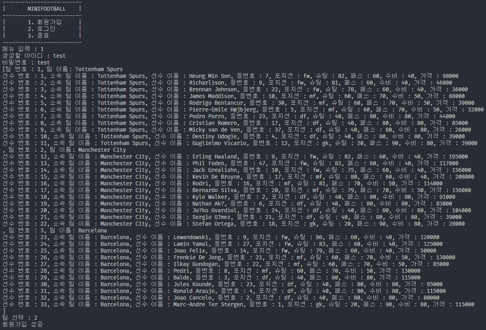
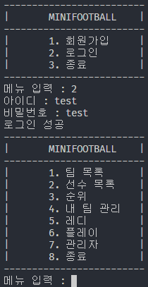
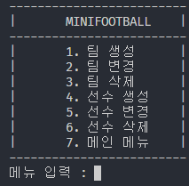
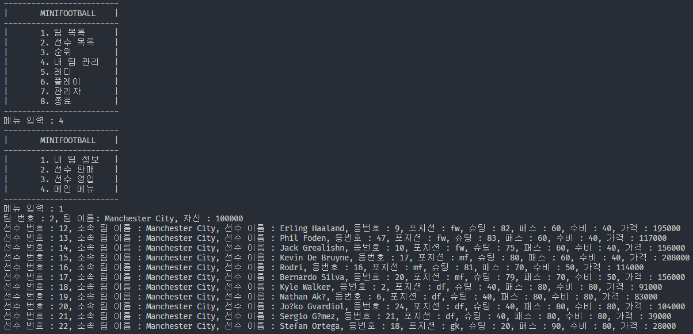
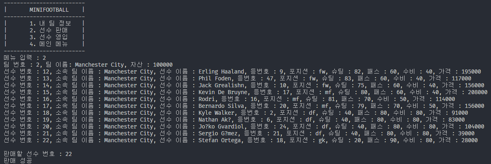
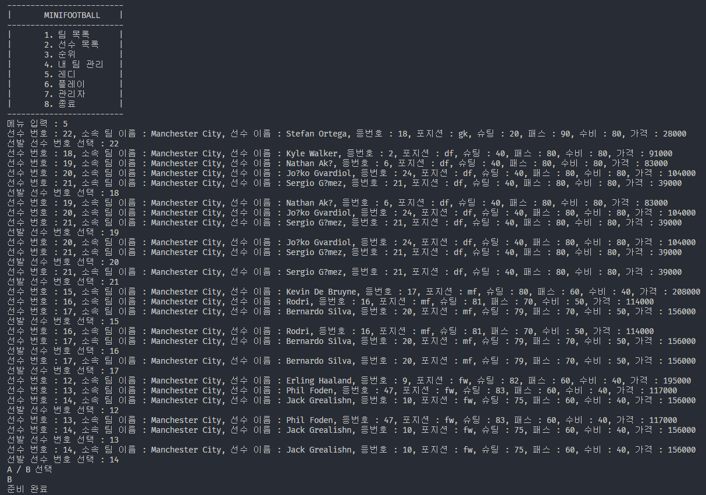
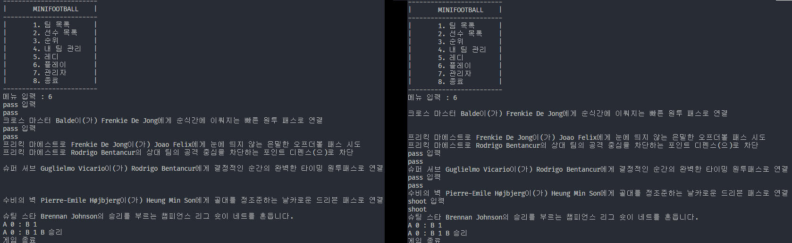
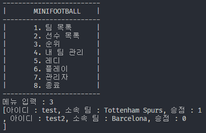

# Mini Football Game

## 정보
- **프로젝트 기간 :** 
- **개발 언어 :** Java

&nbsp;

## 개요
Mini Football Game은 멀티쓰레드 소켓 통신을 활용하여 실시간으로 플레이어들이 1:1 축구 경기를 진행할수 있는 콘솔 기반 미니 게임입니다.

각 플레이어는 클라이언트를 통해 서버에 접속하고, 서버는 실시간으로 플레이어들의 입력을 처리하여 각 요청에 맞는 로직을 수행합니다.

&nbsp;

## 기능

### 회원가입

회원가입을 통해 팀을 선택할 수 있으며, 유저는 선택한 팀의 선수들을 보유하게 됩니다.

&nbsp;

### 로그인

회원가입을 통해 생성된 계정으로 로그인을 진행합니다.

로그인시 클라이언트별 Session 객체에 고유의 SessionID와 Admin 여부를 저장합니다.

&nbsp;

### 관리자 메뉴

관리자 메뉴에서는 팀과 선수를 생성하거나 변경, 삭제 할 수 있습니다.

1차로 Session 객체를, 2차로 DB를 확인해 접속한 유저가 관리자 권한이 없다면 접속할 수 없습니다.

&nbsp;

### 내 팀 관리

- **내 팀 정보**

로그인한 유저의 정보를 볼 수 있습니다.

&nbsp;

- **선수 판매**

본인의 팀에 속해있는 선수를 판매할 수 있습니다.

&nbsp;

- **선수 영입**

새로운 선수를 영입할 수 있습니다.

&nbsp;

### 게임 대기열 입장

게임을 진행하기 전 대기열에 입장합니다.

선발에 나갈 선수들을 선택하고, GK부터 DF, MF, FW 순으로 선택하게 됩니다.

중복 선택을 방지하고자 선수 리스트가 제공되며, 본인이 소유한 선수가 아닌 선수를 입력하거나, 선수가 중복으로 선택되어 총 11명의 선수가 선택되지 않는다면 대기열에 입장할 수 없습니다.

선수 선택이 완료됐다면 게임 로직에 필요한 A, B를 선택 후 준비를 완료합니다.

&nbsp;

### 게임 플레이

 

입력받은 A와 B를 활용해 공수턴을 나누어 진행되며, 공격 턴에는 패스 2번 성공시 슛 기회를 얻게 됩니다.

패스 도중 상대팀의 선수에게 가로막혔다면 턴이 종료되고 공수가 변경되며, 슛은 성공 여부와 상관없이 진행시 턴이 종료됩니다.

&nbsp;

- **순위**

라운드가 종료되면 우승한 유저의 우승 포인트가 1점 상승합니다.
